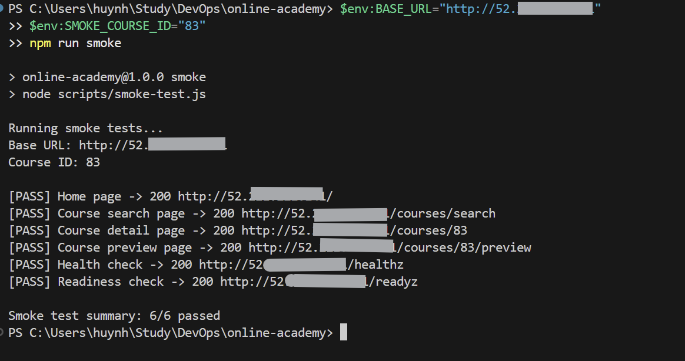
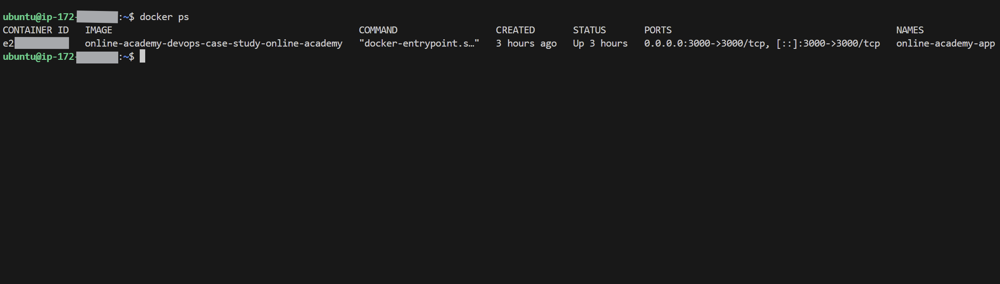
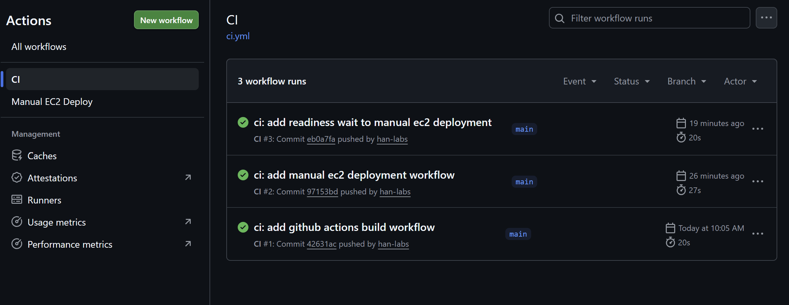
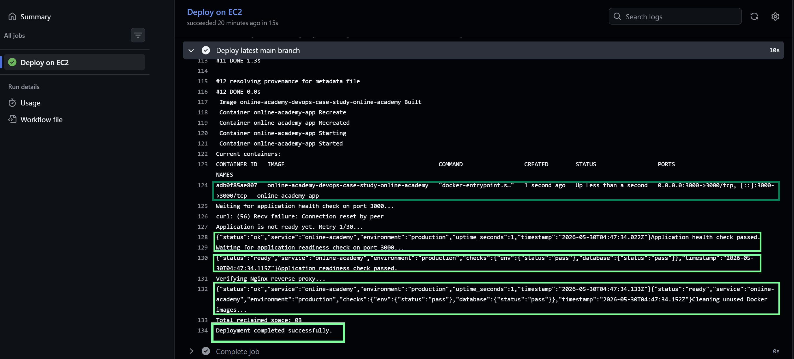

# Online Academy DevOps Case Study

## Overview

Online Academy is a Node.js and Express web application for online course learning. It supports course browsing, course details, user authentication, role-based access, free preview lessons, student learning flow, progress tracking, reviews, and instructor/admin course management.

This repository is maintained as a DevOps-focused case study. The goal is to improve an academic web application into a production-ready portfolio project with Docker, AWS EC2, Nginx, Render, GitHub Actions CI/CD, health checks, smoke testing, and operational documentation.

## Live Demo

Render live demo:

```text
https://online-academy-hnnq.onrender.com
```

The Render deployment is used as the stable public demo environment with HTTPS and Google OAuth login.

The AWS EC2 deployment is used as a documented DevOps case study. The EC2 instance is not kept running continuously to control cloud cost.

## DevOps Highlights

* Containerized the Node.js application with Docker and Docker Compose
* Deployed the application to AWS EC2 Ubuntu
* Configured Nginx as a reverse proxy in front of the Dockerized app
* Restricted public access to the internal application port
* Added `/healthz` and `/readyz` endpoints for health and readiness checks
* Added smoke testing for post-deployment verification
* Replaced in-memory session storage with PostgreSQL-backed sessions
* Implemented GitHub Actions CI for dependency installation and Docker build validation
* Implemented GitHub Actions manual CD using a self-hosted runner on EC2
* Hosted the public demo on Render with HTTPS and Google OAuth
* Prepared deployment guide, runbook, architecture notes, and deployment screenshots
* Documented lightweight observability using health/readiness checks, smoke tests, Docker logs, Nginx logs, AWS Budget Alert, and CloudWatch basic metrics

## Tech Stack

| Area          | Technologies                                 |
| ------------- | -------------------------------------------- |
| Backend       | Node.js, Express.js, JavaScript              |
| Frontend      | Handlebars, Bootstrap 5                      |
| Database      | Supabase PostgreSQL                          |
| Session Store | PostgreSQL-backed session storage            |
| Deployment    | Docker, Docker Compose, AWS EC2, Render      |
| Reverse Proxy | Nginx                                        |
| CI/CD         | GitHub Actions, self-hosted runner           |
| Verification  | Health checks, readiness checks, smoke tests |

## Architecture

Render live demo:

```text
User Browser
-> Render HTTPS Web Service
-> Node.js Express Application
-> Supabase PostgreSQL
```

AWS EC2 DevOps deployment:

```text
User Browser
-> EC2 Public IPv4, Port 80
-> Nginx Reverse Proxy
-> Docker Container, Node.js App on Port 3000
-> Supabase PostgreSQL
```

On EC2, port `3000` is not publicly exposed. Public traffic goes through Nginx on port `80`.

## Screenshots

### EC2 Nginx Deployment


### Smoke Test Result



### Docker Container on EC2



### GitHub Actions CI/CD





## CI/CD Summary

### Continuous Integration

Workflow file:

```text
.github/workflows/ci.yml
```

CI validates:

* source checkout
* Node.js setup
* dependency installation with `npm ci`
* Docker image build

### Manual Continuous Deployment

Workflow file:

```text
.github/workflows/deploy.yml
```

Manual CD flow:

```text
GitHub Actions
-> Self-hosted runner on EC2
-> Pull latest main branch
-> Rebuild and restart Docker Compose service
-> Verify /healthz
-> Verify /readyz
```

Manual deployment is used to control cloud cost because the EC2 instance is not intended to run continuously.

## Health, Readiness, and Smoke Test

Health check:

```text
GET /healthz
```

Readiness check:

```text
GET /readyz
```

Run smoke test:

```bash
npm run smoke
```

Expected result:

```text
Smoke test summary: 6/6 passed
```

The smoke test verifies:

* homepage
* course search page
* course detail page
* course preview page
* health check
* readiness check

## Documentation

| Document                             | Purpose                                                                       |
| ------------------------------------ | ----------------------------------------------------------------------------- |
| [DEPLOYMENT.md](DEPLOYMENT.md)       | Deployment guide for Docker, AWS EC2, Nginx, Render, and CI/CD                |
| [RUNBOOK.md](RUNBOOK.md)             | Operations commands, troubleshooting steps, and monitoring checklist          |
| [ARCHITECTURE.md](ARCHITECTURE.md)   | System architecture, request flow, database overview, and deployment topology |
| [docs/screenshots](docs/screenshots) | Deployment evidence screenshots                                               |
| [OBSERVABILITY.md](OBSERVABILITY.md) | Lightweight observability notes, monitoring checklist, logs, metrics, and future improvements |

## Environment Configuration

Real secrets are managed through environment variables and are not committed to GitHub.

Required variables include:

```env
NODE_ENV=production
SESSION_SECRET=your-session-secret

DB_HOST=your-database-host
DB_PORT=5432
DB_USER=your-database-user
DB_PASSWORD=your-database-password
DB_NAME=postgres
DB_SSL=true

SESSION_STORE=postgres
COOKIE_SECURE=true
TRUST_PROXY=true

GOOGLE_CLIENT_ID=your-google-client-id
GOOGLE_CLIENT_SECRET=your-google-client-secret
GOOGLE_CALLBACK_URL=https://your-render-url/auth/google/callback
```

## Local Development

Install dependencies:

```bash
npm ci
```

Start the application:

```bash
npm start
```

Open:

```text
http://localhost:3000
```

## Docker Local Run

```bash
docker compose up -d --build
```

Check container:

```bash
docker ps
```

Verify health and readiness:

```bash
curl -i http://localhost:3000/healthz
curl -i http://localhost:3000/readyz
```

## Project Purpose

This project demonstrates practical readiness for DevOps Intern or Backend Intern roles.

Main learning outcomes:

* application containerization
* Linux server operation
* AWS EC2 deployment
* Nginx reverse proxy configuration
* secure environment variable management
* PostgreSQL session storage
* health and readiness checks
* smoke testing
* GitHub Actions CI/CD
* deployment documentation and runbook writing
* cost-aware cloud usage
